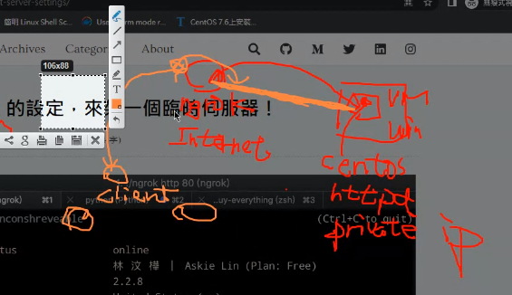
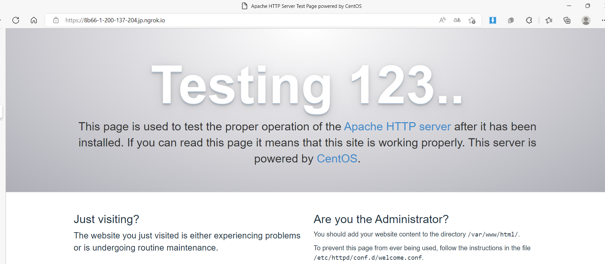

## Ngrok

outside world can't access vm, because it is private ip

So we use ngrok server, let the outside world can access our (vm's)http server

The server in Internet

ngrok 與 vm 建立連線

client 傳訊息給ngrok, ngrok 再傳給vm

[Your Authtoken - ngrok](https://dashboard.ngrok.com/get-started/your-authtoken)

下載完後和認證後

`cd /var/www/html`

`gedit /etc/httpd/conf/httpd.cnf`

Listen: 改成 80

`systemctl restart httpd`

`ngrok http 80`(或是開的port在你聽的位置)

## Command

`rpm -qa | grep httpd`: query(`q`) all(`a`) the software in the system then use pipe to grep. if it show something , it mean httpd already installed.

`netstat -tunlp | grep 80`: 查看系統TCP,UDP port號有沒有打開

`lsof -i 80`:  跟`netstat -tunlp |grep 80`類似不過會看到他的child process...

`curl 127.0.0.1`: 有東西 => 網站正常