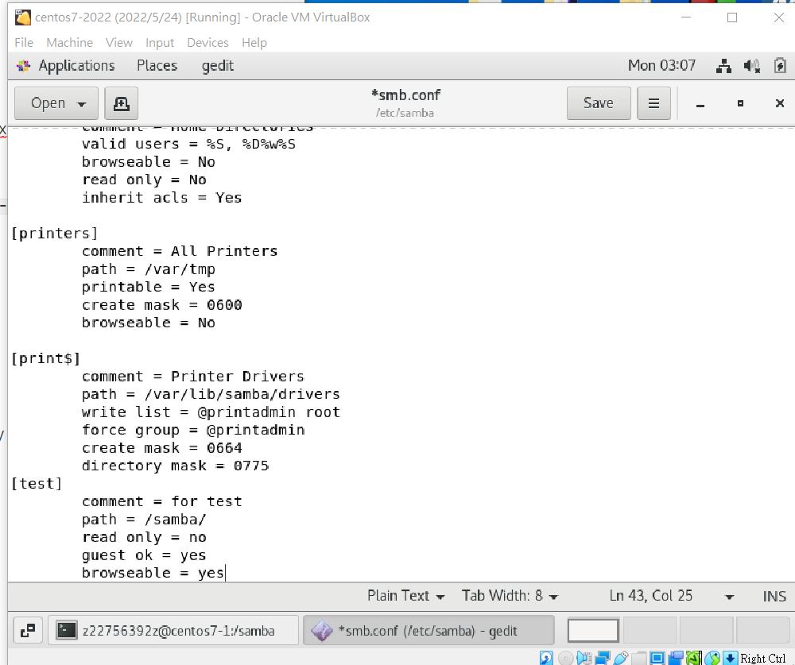

## SAMBA

[透過SAMBA讓CentOS與Windows共享目錄 - Joseph's blog (josephjsf2.github.io)](https://josephjsf2.github.io/linux/2019/11/01/share_centos_folder_with_windows.html)

server : samba

nfs use linux base computers

samba: window can talk to the linux, access the file in linux system

install :`yum install samba samba-client samba-common - y`

config file : `/etc/samba/smb.conf`

`read only = no` 可寫入

`chmod 777 /samba/` 無法儲存 因為User的權限

(記得關防火牆)

window + R type the ip address`\\192.168....` (linux ip address)

`smbapasswd -a user` 增加使用者密碼 

window switch user:

清除別的使用者帳號

window:`net use * /delete`

----

`/etc/default/grub`

GRUB_TIMEOUT = 10

`grub2-mkconfig -o /boot/grub2/grub2.cfg`

add one after quient ==> go to single user mode (維修)

---

reinstall centos

