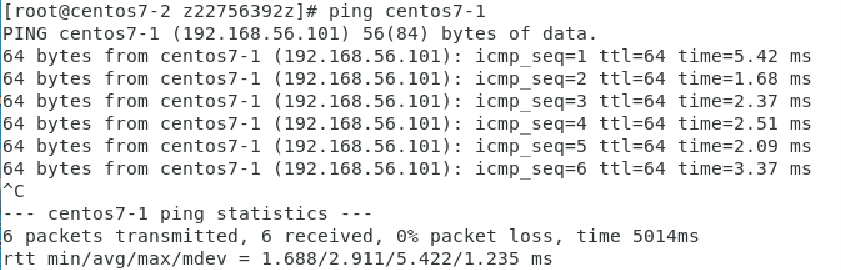

enp0s3 : nat (連上網路的)

enp0s8 : hostonly

### Fix ip setting

* gui setting

  * click network icon -> wired setting -> click the one you want set

  

  ​	address :the ip you want to fix

  

  設定完兩台固定IP後

  兩台都修改下面的檔案

  `gedit /etc/hosts` :

  ```
  192.168.56.110 newhost1
  192.168.56.112 newhost2
  ```

  `ping newhost` : 它會自動ping /etc/hosts下 你連結的ip

  

### 自動密碼登入

`ssh-keygen`: 產生公和私鑰

`/root/.ssh` : 產生出來的放在這裡

`ssh-copy-id root@newhost1`: 功能是用于将本地生成的SSH公钥信息复制到远程主机。通常情况下，运维人员会先使用ssh-keygen命令生成出SSH密钥对文件，随后使用ssh-copy-id命令将公钥文件复制到远程主机上，这样操作后再进行远程SSH访问时将无需进行账号密码的口令验证，而是通过密钥方式登录。

`ssh root@newhost1` : 登入

# cmd

* `hostnamectl set-hostname newname`  : 如果沒有變更 打看看`bash` 