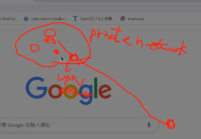
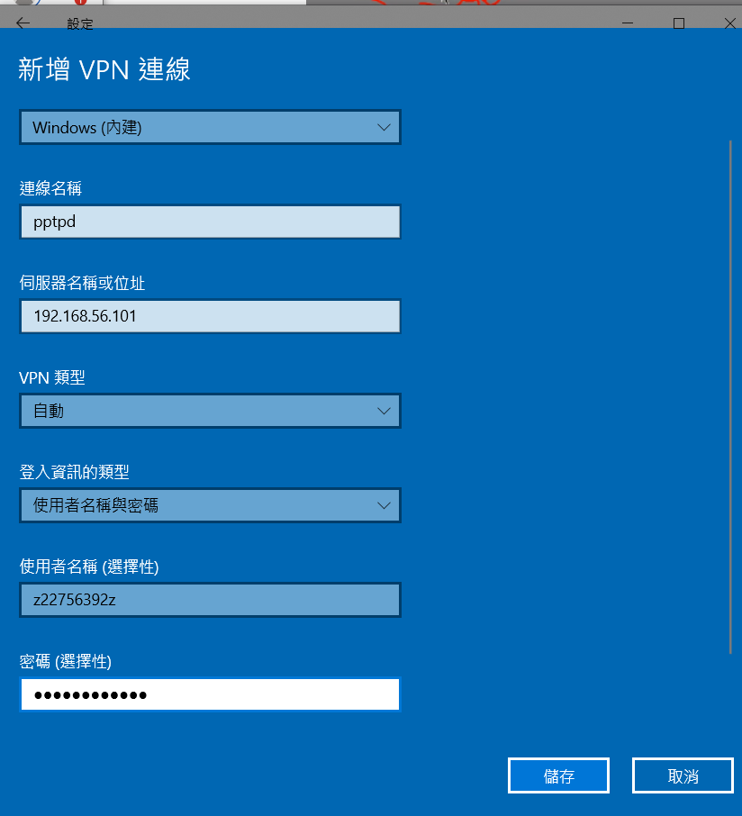
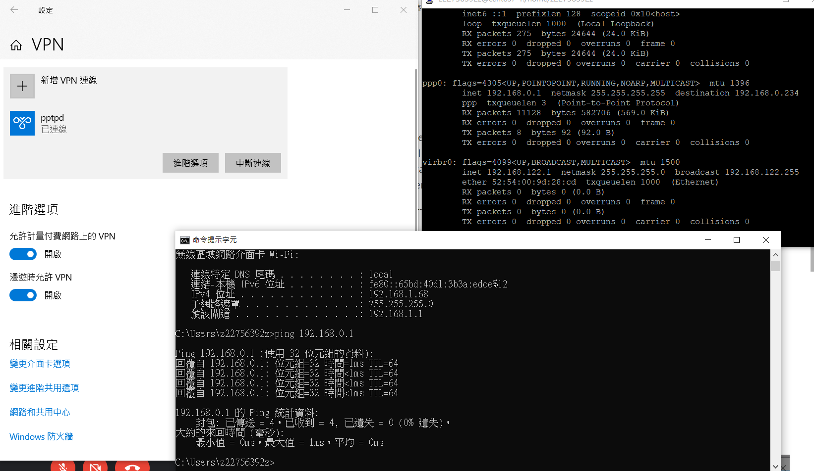
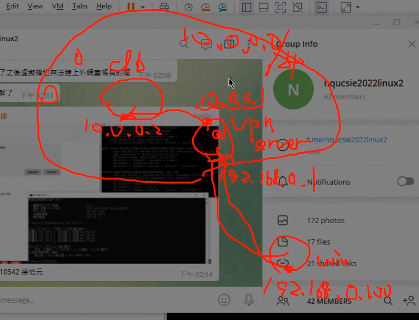

## PPTPD

[如何使用CentOS 7实例配置PPTP VPN服务端到客户端的连接 (aliyun.com)](https://help.aliyun.com/document_detail/41345.html)

vpn (virtual private network) service




In that private network, there are lots of server. When you are in that private network, you can access all the server inside it. But when you are not in that private network you can't access. You can use vpn server, after authentication you establish the  virtual link, then you can access server inside that private server.

vpn server ---- server-client model


#### Inside software

`yum install -y ppp pptpd`

#### config

`/etc/pptd/conf/`

virtual interface 

* local ip: 192.168.0.1

* remote ip: 192.168.0.234.238.....

`/etc/ppp/chap-secrets/`

```
# Secrets for authentication using CHAP
# client server secret IP addresses
z22756392z pptpd z0933172669z *
```


#### window vpn connection



#### result



#### others



forward your request to the database with this 10.0.0.0/24 you can connect to all the server in this network