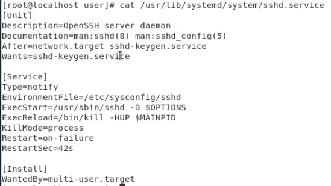

## linux service:

* standalone service: run in background
  * responsive
  * cost resource (stand-by)
  * .service

* xinetd:
  * delegate--stand-by. When client enter, it activate service.  client leave, service disable.
  * slow response
  * .socket

​	

## create systemd service

https://blog.gtwang.org/linux/linux-create-systemd-service-unit-for-python-echo-server-tutorial-examples/

```python
#!/usr/bin/env python3
import socket

# 建立 socket,SOCK_STREAM是TCP
serv = socket.socket(socket.AF_INET, socket.SOCK_STREAM)

# 綁定所有網路介面的 9000 連接埠
serv.bind(('0.0.0.0', 9000))

# 開始接受 client 連線
serv.listen()

while True:

    # 接受 client 連線
    conn, addr = serv.accept()
    print('Client from', addr)

    while True:

        # 接收資料
        data = conn.recv(1024)

        # 若無資料則離開
        if not data: break

        # 傳送資料
        conn.send(data)

    conn.close()
    print('Client disconnected')
```

`systemctl daemon-reload`:如果configuration file改變


## Telnet

[CentOS 7.x安装telnet服务端_-纸短情长的博客-CSDN博客](https://blog.csdn.net/l_liangkk/article/details/105401435)

```
service telnet
{
	flags = REUSE
	socket_type = stream
	wait = no
	user = root
	server = /usr/sbin/in.telentd
	log_on_failure += USERID
	disable = no
}
```


## Command

* `pstree`: process tree, systemd is the first program.


> systemd vs init
>
> init 依序一一啟動
>
> systemd 可以判斷相依姓 如果沒有上下關係 啟動可以並行，相反如果有先啟動上的，再下。開機更快

> system[d]: daemon(守護進程):背景執行應用程式

* `ps -aux | grep systemd`: 看systemd 資料
* `systemctl`: look up each service status

> systemd is make up of Unit and Target
>
> In order to control various service, it will need config file. the config file is located in:
>
> ex: /usr/lib/systemd/system/sshd.service,
>
> /etc/systemd/system/
>
> with this configuration file systemd will know how to manage this service
>
> Unit content included:
>
> 
>
> [Unit]基本描述
>
> man::sshd(8):查看手冊 == man 8 sshd
>
> After=network.target sshd-keygen.service
>
> 需要再network.target和sshd-keygen.service啟動後啟動
>
> Wants=sshd.keygen.service 意思是 network.target不用執行成功只需要sshd.keygen.service成功的執行
>
> [Service] 執行環境 執行時的指令
>
> ExecStart =/usr/sbin/sshd -D $OPTIONS
>
> 使用systemctl start sshd 他會跑個指令
>
> ExecReload =/bin/kill -HUP $MAINPID 一樣 systemctl reload sshd用後 跑他後面的指令 而-HUP意思是-1 == kill -1 $MAINPID (用kill -l 查看 -1 的意思: 重新啟動)
>
> [Install] 
>
> WantedBy=multi-user.target 需要再多人模式才能加載成功
>
> Target 代表一個階段的標
>
> 在早期Init 有7個階段(runlevel) 1 : 單人模式， 3: 文字模式， 5:圖形化模式
>
> 而Target取代runlevel
>
> 1 sysinit.target 
>
> 2 basic.target
>
> 3 mulit-user.target == runlevel 3
>
> 4 graphical.target == runlevel 5
>
> 5 default.target

```
[root@centos7-1 z22756392z]# cat /usr/lib/systemd/system/graphical.target
#  This file is part of systemd.
#
#  systemd is free software; you can redistribute it and/or modify it
#  under the terms of the GNU Lesser General Public License as published by
#  the Free Software Foundation; either version 2.1 of the License, or
#  (at your option) any later version.

[Unit]
Description=Graphical Interface
Documentation=man:systemd.special(7)
Requires=multi-user.target
Wants=display-manager.service
Conflicts=rescue.service rescue.target
After=multi-user.target rescue.service rescue.target display-manager.service
AllowIsolate=yes

```

> systemctl 下 graphical.target的configuration file
>
> Conflicts 代表有他 就不能執行rescue.service 和 rescue.target

* `man number tolookuptarget `: (manual)different `number` mean different usage manual.   `tolookuptarget`: ex:sshd(service),open(function method)....
* `kill -l`: 查看所有訊號
* `kill -9`:強制停止 不同號碼有不同功能，看`kill -l` 得知所有號碼的意思
* `systemctl ioslate multi-user.target`: 切到文字化界面
* `systemctl ioslate graphical.target`:切到圖形化介面
* `systemctl set-default multi-user.target`:系統預設 ，開機時自動到...模式
* `systemctl daemon-reload`:如果configuration file改變
* `netstat -tunlp | grep :23` : check whether 23 port is open 

## Port

* http:80
* ssh:22
* telent:23
* https:443
* named:53