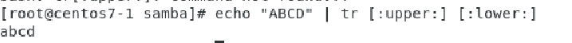

[Ngrok](./Ngrok.md)

## Command

`du` : estimate file  space usage(磁碟使用狀況)

當目錄及他的子目錄的使用情況 (如果再root用就全部都列出來)

`-h`:(option)  把檔案大小變成我們常看的單位 K , M ,G...

`du -h`: 磁碟使用狀況單位是K,M,G

`cd ..`: 上一層

`du -s -h`:  summary 當前目錄的使用量 (不單獨顯示子目錄使用量) 

`du -s -h /home`: 看home的使用量

`du -h --max-depth=1 /var`: var底下最低多一層的目錄使用量

`df -h` :  tmpfs(swap) , /dev/mapper/centos-root (在開機時最少需要兩個分割區 就是這兩個(swap, root))

抓特定欄位 `df -h |grep /dev/shm/ | awk'{print $5}' | tr "%" " "`

`df -h |grep '[/]$' | awk'{print $5}' | tr "%" " "`

`free -m`: 記憶體狀況

`-dd` : try copy one file from one drive to another drive ,or create certain size file

`dd if=/dev/zero of=file3m bs=1M count=3 3+0`: 去零的裝置 每次讀1M的零 放到file3m 每讀三次 => 得到3M大小檔案

`wc a.txt`:`wc`(word count)

`wc -l a.txt`: 

`wc -w a.txt `: -w(word)`幾個字

`wc -c a.txt`: `-c` (char)幾個字元

`tr`:轉換或刪除

`df -h |grep '[/]$' | awk'{print $5}' | tr "%" " "`: 取代"%" 用" "

`echo "ABCD" | tr [:upper:] [:lower:]`: 把大寫 取代成小寫

`echo "123abc@*@#$ | tr [:alnum:] "#"` : al(alpha) num(number)

`echo "123 123 " | tr [:blank:] "#"`: blank 空白 ==> "123#123#"

`echo "ABCD123@" | tr -d [:digit:]` : `-d` (delete) `[:digit:]`(數字)=> ABCD@

#### careful

`echo "abcABC123!<" | tr -d "a-zA-B1-2"`: => C3!<

`echo "0933-172-669" |tr -d "-" | cut -c 1-4`: `cut -c 1-4`取1到4 =>0933 